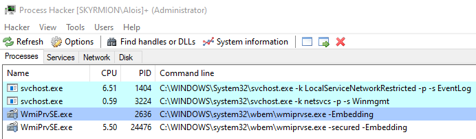
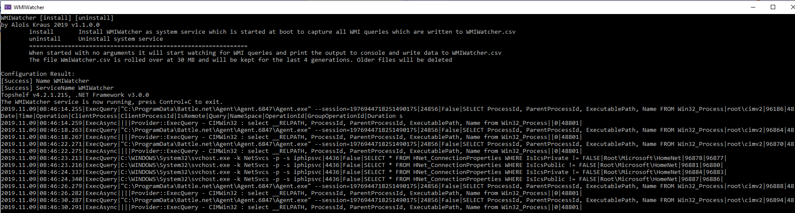
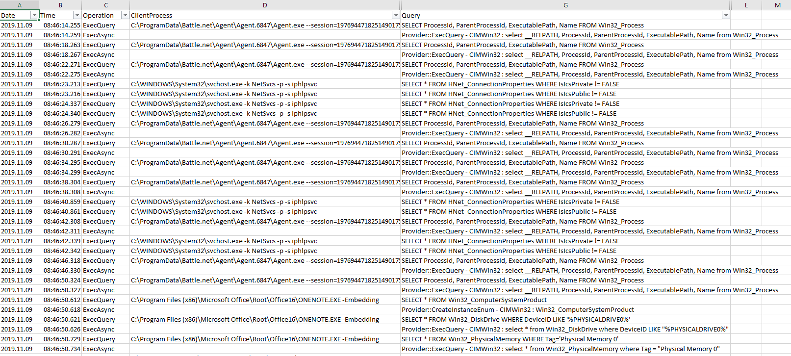
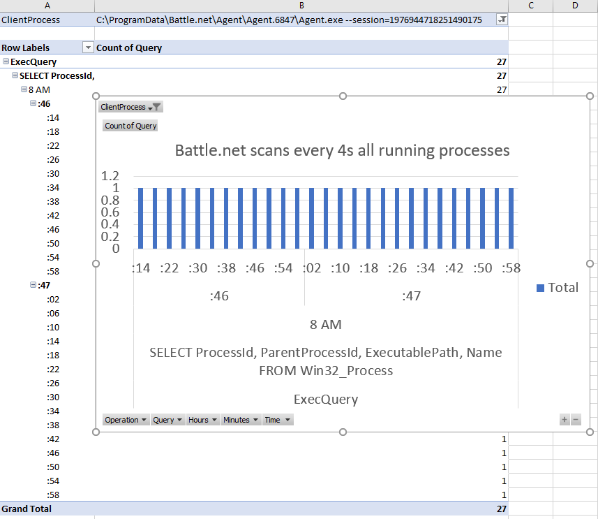
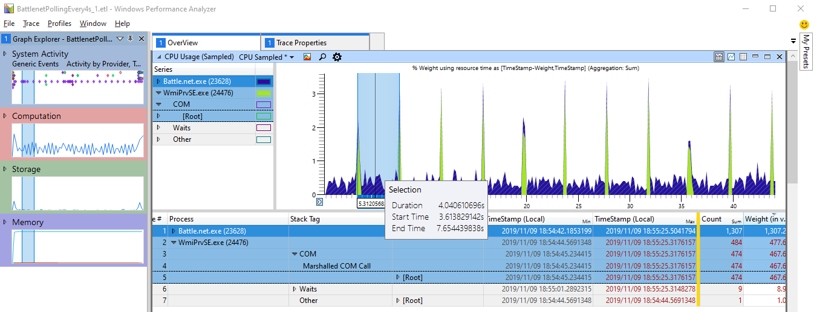

# WMIWatcher

## Purpose 

Have you ever wondered why svchost.exe and WmiPrvSE.exe are consuming for a long time CPU on your system?


This is caused by WMI queries executed by system management, security, monitoring or just slow software installed by your system administrator.
WMI is the secret weapon of administrators to sniff on your PC at without asking you. Usual queries are

- Which software do you have installed?
- Is the virus scanner up to date?
- Is Bitlocker enabled? 
- Is the Virus Scanner enabled?
- Which processes are running?
- ....

If you suspect something strange is happening on your machine, chances are good that some software is executing expensive WMI queries. This also can include
malicious software which also uses WMI quite a lot to e.g. start processes in a stealthy way. 
Until today it was very hard to find out which query was executed by which process.
There is WMI Activity Tracing built in into Windows ([some example events](https://www.darkoperator.com/blog/2017/10/14/basics-of-tracking-wmi-activity)) which is very complex 
(see [Bruce Dawson](https://randomascii.wordpress.com/2017/09/05/hey-synaptics-can-you-please-stop-polling/)) to use. 


## What Do You Get?

WMIWatcher will give you a live view of all executed WMI Queries on your system and the ability to log all queries (including the boot phase where many bad things happen).
The log file a CSV file which you can open with Excel and analyze further to understand which processes execute which queries. 



The console is good to get an overview what is currently running and to test if WMIWatcher is working. But normally you want to analyze the data
with Excel. Besides the exe there is WmiWatcher.csv which has | as column separator. When you open it it Excel will automatically split
the CSV file. To view Time as time you need to enter hh:mm:ss.000 as custom time format and you are ready to analyze your machine.


All WMI Activity and initiating processes are no secret anymore. Now you can blame the right processes for their expensive WMI queries. E.g. lets check what Blizzards Battle.net is doing
to my machine. I play sometimes StarCraft II (I am getting old) which requires these game launchers. Where are the old times where you could install and run a game without any Internet connection?

After doing a little pivot table stuff I get this:


When profiling I quickly find on my machine the recurring spikes
with a 4s interval


WMI is all about executing work on behalf of someone else. This can lead even good application developers down the wrong path by believing that if their application 
does not consume CPU that they did everything correctly. Most often the delegated work to WMI is not taken into account leading to big CPU consumption in some cases
which cannot be attributed to the origin.

The most dangerous queries besides slow ones are Polling Queries which are really bad because you can set the poll interval up to 1s which happens far too often. 
To find these ones either search for queries with WITHIN in the query string or filter the Operation field to NotificationQuery which 
will show you every new polling query. 
When the polling timeout has elapsed the Operation column will contain an ExecAsync call without a preceding Exec call. A synchronous WMI query is showing up first as Exec and then one more time 
as ExecAsync. Missing Exec calls for a query is also an indication of a polling WMI query.

## Running Time

WMIWatcher is a .NET 7.0 self contained application. Unzip it to a folder, run 
```
    C:>WMIWatcher.exe install
    C:>sc start wmiwatcher
```
to install WMIWatcher as Windows system service which is automatically started. 
Besides the exe the WmiWatcher.csv file will be created
Alternatively you can run it also directly as console application. Simply start
```
C:>WMIWatcher.exe
WMIWatcher [install] [uninstall]
by Alois Kraus 2019 v1.1.0.0
        install       Install WMIWatcher as system service which is started at boot to capture all WMI queries which are written to WMIWatcher.csv
        uninstall     Uninstall system service
        ==============================================================
        When started with no arguments it will start watching for WMI queries and print the output to console and write data to WMIWatcher.csv
        The file WmiWatcher.csv is rolled over at 30 MB and will be kept for the last 4 generations. Older files will be deleted

Configuration Result:
[Success] Name WMIWatcher
[Success] ServiceName WMIWatcher
Topshelf v4.2.1.215, .NET Framework v7.0
The WMIWatcher service is now running, press Control+C to exit.
2019.11.09|21:45:52.703|ExecQuery|"C:\ProgramData\Battle.net\Agent\Agent.6847\Agent.exe" --session=1976944718251490175|24856|False|SELECT ProcessId, ParentProcessId, ExecutablePath, Name FROM Win32_Process|root\cimv2|124462|48801|
Date|Time|Operation|ClientProcess|ClientProcessId|IsRemote|Query|NameSpace|OperationId|GroupOperationId|Duration s
2019.11.09|21:45:52.707|ExecAsync||||Provider::ExecQuery - CIMWin32 : select __RELPATH, ProcessId, ParentProcessId, ExecutablePath, Name from Win32_Process||0|48801|
....
```

That gives you a live view of all running WMI Queries. 

## Going Deeper
If you see many different queries but you are unsure which ones are CPU hogs you need to capture also some ETW profiling data.
To do that execute on your command line (wpr is part of Windows 10 no need to install extra tools if you just want to record)
```
C>wpr -start CPU
```
let it run for 30-60s and then execute
```
C>wpr -stop c:\temp\HighCPUWMIIssue.etl
```
and analyze with the Windows Performance Toolkit which is part of the Windows 10 SDK (https://developer.microsoft.com/en-US/windows/downloads/windows-10-sdk/). 
You do not need to download the full Windows 10 SDK. It is sufficient to uncheck all check boxes except for WPT.

